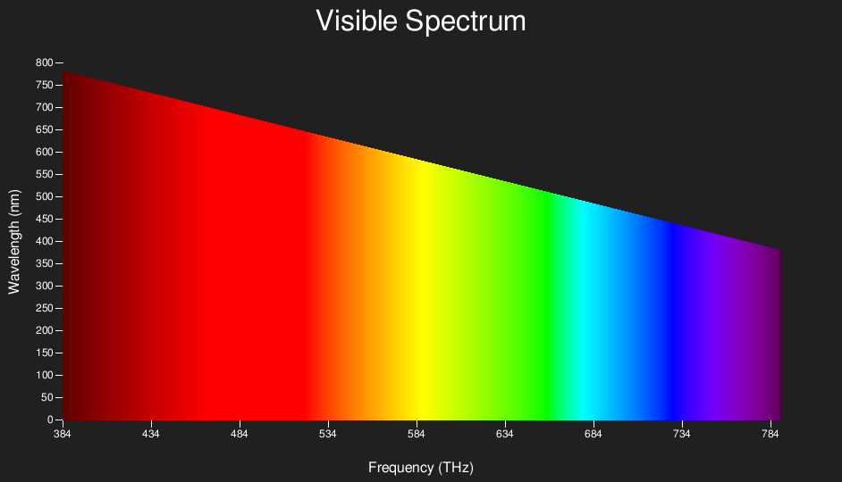

# Reprodução do espectro visível no Python

Este artigo foi inspirado no projeto de *Chris Webb* disponível em http://www.codedrome.com/exploring-the-visible-spectrum-in-python/. 
O código desenvolvido pelo autor original, transformado em uma *Classe*, foi reproduzido integralmente.

### Espectro eletromagnético

A energia radiante emitida pelo sol se propaga através de um meio denominado **campo eletromagnético**. O espectro eletromagnético, que se estende desde comprimentos de onda muito curtos associados aos raios cósmicos, até as ondas de rádio de baixa freqüência e grandes comprimentos de onda, pode ser disposto de maneira contínua em função das duas propriedades básicas das ondas.

  

### Escudo protetor

A atmosfera terrestre possui uma camada protetora, composta por gases absorvedores da radiação eletromagnética. Estão presentes, em grande quantidade:
vapor d'água, oxigênio, ozônio e gás carbônico. E, em menor quantidade: monóxido de carbono, metano, monóxido de nitrogênio ou óxido nítrico e óxido nitroso.

Os gases radiativos presentes na atmosfera, ao absorverem praticamente todos os raios gama, X e ultravioleta, antes que atinjam a troposfera, impedem efeitos deletérios à vida na Terra. Por outro lado, a faixa do espectro visível, responsável por processos físico-químicos, é apenas ligeiramente atenuada pela atmosfera.

### O espectro visível

No livro *Learning Scientific Programming with Python*, de *Christian Hill*, disponível online em https://scipython.com/book/, há um programa que exibe as diferentes regiões do espectro eletromagnético. O código do programa foi reproduzido no notebook_*spectrum.ipynb*.

Logo abaixo do espectro visível, ficam as ondas ultravioletas. E logo acima, as infravermelhas.

### Propriedades básicas das ondas

As propriedades básicas das ondas são: amplitude, comprimento e frequência. 
A distância entre a extremidade da *crista*(ponto mais alto) e a o eixo central da onda é chamada **amplitude**. 
A distância horizontal entre dois *vales* ou *cristas* consecutivas é chamada **comprimento de onda**. 
O número de comprimentos de onda completos que passam por um determinado ponto no espaço a cada segundo é conhecido como **frequência**. 

O comprimento de onda e a frequência são inversamente proporcionais, isto é, quanto menor o comprimento de onda, maior será a frequência, e vice-versa.

Visualizemos as duas últimas propriedades graficamente, através das funções escritas por *Chris Webb*.

### Comprimento de onda

O tamanho das ondas aumenta da esquerda para a direita.

### Frequência 

A frequência das ondas aumenta da esquerda para a direita.

Fontes: 

http://www.codedrome.com/exploring-the-visible-spectrum-in-python/
https://pt.khanacademy.org/science/physics/light-waves/introduction-to-light-waves/a/light-and-the-electromagnetic-spectrum
